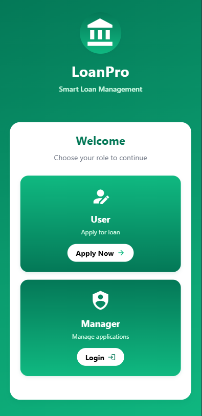
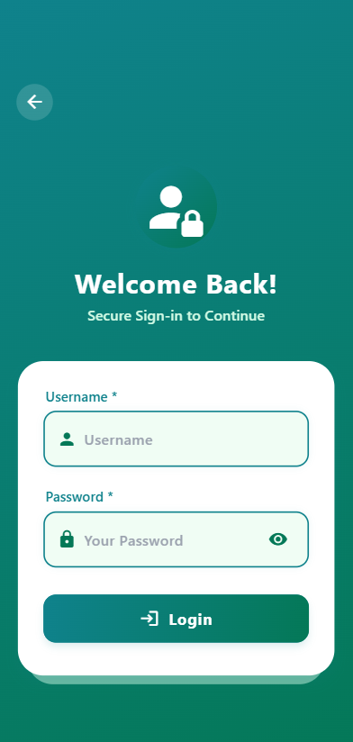
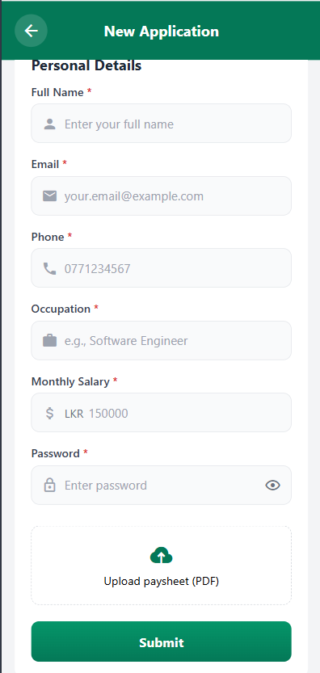
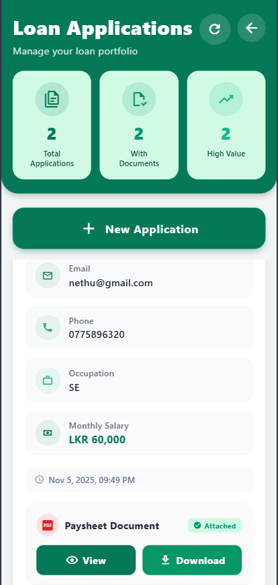

# 📱 Loan Application Management System

## 📝 Project Description
The **Loan Application Management System** is a **React Native** mobile application built with **TypeScript** and styled using **Tailwind CSS (NativeWind)**.  
It provides an intuitive and modern solution for **bank managers** and **loan applicants** to manage loan requests efficiently.

Applicants can submit loan applications with paysheet PDFs, while managers can securely review, update, and manage those applications in real-time.

---

## 🚀 Features

### 👤 Applicant Features
- 🧾 **Loan Application Form:** Submit applications with personal & financial details
- ✅ **Input Validation:** Real-time validation for name, email, phone, and salary fields
- 📎 **Document Upload:** Attach and preview paysheet PDFs from device storage
- 💾 **Offline Support:** Applications stored locally using AsyncStorage

### 👨‍💼 Manager Features
- 🔐 **Secure Login:** Protected access with persistent session management
- 🧠 **Session Handling:** Stored using AsyncStorage to maintain login state
- 📋 **Application Overview:** View all submitted applications with dynamic updates
- ✏️ **Edit Functionality:** Update applicant information easily
- 🗑️ **Delete Functionality:** Remove records with confirmation alerts
- 📂 **Document Viewing:** Open and view uploaded paysheet PDFs in-app
- 🚪 **Logout:** Secure session termination and navigation reset

---

## 🧩 Technologies Used

### ⚙️ Core Stack
- **React Native (Expo)** — Cross-platform mobile development
- **TypeScript** — Type-safe, scalable codebase
- **Tailwind CSS (NativeWind)** — Responsive and modern UI styling

### 🧱 Architecture & Patterns
- **MVVM (Model-View-ViewModel)** — Clean architecture for maintainability
- **Repository Pattern** — Data handling abstraction for scalability
- **React Context API** — Global state and authentication management

### 📚 Libraries & Tools
- **Expo SDK** — Development and build toolset
- **React Navigation** — Navigation and route management
- **AsyncStorage** — Persistent local storage
- **Axios** — API calls and data fetching
- **React Native PDF** — PDF viewing in app
- **React Native File System (expo-file-system)** — File handling
- **React Native Vector Icons** — Icons for modern UI
- **React Hook Form + Yup** — Input validation
- **ActivityIndicator / Alerts** — Feedback & UX enhancements

---

## 🎨 UI & UX
- Designed with **Tailwind CSS (NativeWind)** for a consistent and responsive layout
- Gradient backgrounds using **Expo LinearGradient**
- Smooth user experience with animated buttons and transitions

---

## Screenshots

### Welcome Page


### Login Page


### LoanApplication Page


### Manager Dashboard



---

## APK / Build
Download APK: [LoanApp APK](https://expo.dev/artifacts/eas/gfiT27GWLUpLtMh3b12AFJ.apk)

## GitHub Repository:
https://github.com/nethmidilekshakavi/Android-Developer-Pre-Interview-Assignment.git


## 🧠 System Flow

```plaintext
Applicant → Loan Form → Upload PDF → Save / Submit  
Manager → Login → View Applications → Edit / Delete → View PDF  

